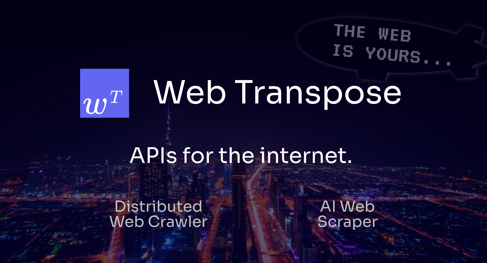

<a href="https://webtranspose.com">
  
  <h1 align="center">Web Transpose Python SDK Tutorials</h1>
  <p align="center"><b>
    Web Crawler & AI Web Scraper APIs for building new web experiences.
  </b></p>
</a>
<p align="center">
  <a href="https://webtranspose.com"><strong>Website</strong></a> ·
  <a href="https://docs.webtranspose.com"><strong>Docs</strong></a> ·
  <a href="https://webtranspose.com/blog"><strong>Blog</strong></a> ·
  <a href="https://twitter.com/mikegeecmu"><strong>Twitter</strong></a>
</p>

---

Web Transpose is a simple developer API for getting website data. It allows you to get reliable, structured web data for building applications.

```
pip install webtranspose
```

---

## Contents

1. **How to build the [PG Number](https://pgnumber.com/)**. Using Webᵀ Scrape and AI SERP API to build a recursive graph of everybody Paul Graham has ever thanked in his essays.

    - Blog can be found [here](https://webtranspose.com/blog/examples/pg-number)
    - Code can be found in `scrape-tutorials/pg-number.ipynb`
    - [PG Number](https://pgnumber.com/) can be [found here](https://pgnumber.com/).

2. **OpenAI Assitants API**. Using Webᵀ Crawl to build a website chatbot using the OpenAI Assistants API.

    - Blog can be found [here](https://webtranspose.com/blog/examples/assistants-api-website-chatbot).
    - Code can be found in `crawl-tutorials/openai-assistants-api.ipynb`

<br/>


## Learn More

Learn more about Web Transpose at [webtranspose.com](https://webtranspose.com).

